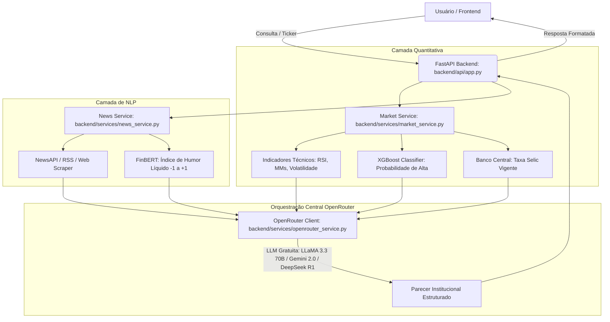

# 📚 Guia Completo da Estrutura do Projeto - SmartInvest AI (TCC)

Este documento descreve a organização das pastas, o papel de cada módulo e como o **OpenRouter (Modelos 100% Gratuitos)** atua como orquestrador central do sistema.

---

## 🗂️ 1. Visão Geral da Nova Estrutura Macro (3 Pilares)

```text
E:\TCC\
│
├── backend/                    # 🚀 MACRO 1: Servidor e Dados (Python)
│   ├── api/                    # Endpoints REST FastAPI (app.py)
│   ├── services/               # Serviços e Orquestração IA (OpenRouter, Market, News, Ranking, Recommendation)
│   ├── database/               # Persistência SQLite, Modelos SQLAlchemy, Seed e Autenticação
│   ├── config/                 # Configuração centralizada (.env, secure_keys.yml)
│   ├── ingestion/              # Ingestão de dados da B3 e Banco Central (Selic)
│   └── data/                   # Base de dados SQLite (smartinvest.db) e parquets brutos
│
├── frontend/                   # 🌐 MACRO 2: Interface Web Completa
│   ├── src/                    # Rotas TanStack, Componentes Liquid, Ticker Bar e API Clients
│   └── package.json            # Dependências NPM do Frontend
│
├── ml/                         # 🧠 MACRO 3: Inteligência Artificial, Pesquisa e Modelos
│   ├── feature_engineering.py  # Engenharia de features temporais e estatísticas
│   ├── stock_model.py          # Treinamento e predição com XGBoost
│   ├── sector_model.py         # Modelagem setorial (Random Forest)
│   ├── score_model.py          # Normalização e cálculo de score composto
│   ├── backtesting.py          # Métricas de Sharpe e validação
│   ├── smartinvest_pipeline.py # Pipeline Markowitz + K-Means
│   ├── models/                 # Modelos treinados (.pkl)
│   ├── notebooks/              # Jupyter Notebooks de pesquisa acadêmica
│   ├── reports/                # Gráficos de backtest e CSVs exportados
│   └── archives/               # Backups compactados e scripts de pesquisa legados
│
├── main.py                     # ⚡ Script Principal para Execução do Pipeline Ponta a Ponta
├── requirements.txt            # 📋 Dependências Python completas
├── secure_keys.yml             # 🔑 Chaves de API
└── .env                        # ⚙️ Variáveis de ambiente locais
```

---

## 🤖 2. O Papel do OpenRouter como Orquestrador de IA

O **OpenRouter** atua como o "cérebro sintético" que conecta os módulos numéricos e textuais:



### 🆓 Modelos 100% Gratuitos Suportados:
O sistema utiliza os modelos com a tag `:free` do OpenRouter:
1. `minimax/minimax-m3:free`
2. `minimax/minimax-m2.7:free`
3. `nvidia/nemotron-3.5-lightning:free`
4. `google/gemma-4-31b-it:free`
5. `z-ai/glm-5.2:free`
6. `openrouter/free`

> **Fallback Automático**: Se algum modelo gratuito estiver temporariamente ocupado ou atingir o limite de requisições, o sistema pula automaticamente para o próximo modelo gratuito sem interromper a experiência do usuário.

---

## 🚀 3. Como Executar o Projeto

### 1. Iniciar o Backend (FastAPI):
No terminal, dentro da pasta `E:\TCC`:
```bash
python -m uvicorn backend.api.app:app --reload --port 8000
```
- Documentação interativa Swagger: **http://localhost:8000/docs**
- Health Check: **http://localhost:8000/api/status**

### 2. Iniciar o Frontend (Vite + React):
Em outro terminal:
```bash
cd frontend
npm run dev
```
Acesse no navegador: **http://localhost:3000** (ou a porta informada pelo Vite).

---

## 🔍 4. Endpoints Disponíveis na API

| Método | Rota | Descrição |
|---|---|---|
| `GET` | `/api/status` | Status da API, modelos de ML e OpenRouter |
| `POST` | `/api/chat` | Chat interativo com a IA (perguntas gerais e ações) |
| `GET` | `/api/analyze/{ticker}` | Análise completa orquestrada (Quant + NLP + IA) |
| `GET` | `/api/ranking` | Ranking multi-fatorial dos melhores ativos |
| `POST` | `/api/smart-invest/optimize` | Perfil K-Means + Fronteira de Markowitz |
| `GET` | `/api/news` | Notícias com sentimento FinBERT |
| `GET` | `/api/stocks` | Lista de ações e FIIs cobertos |
